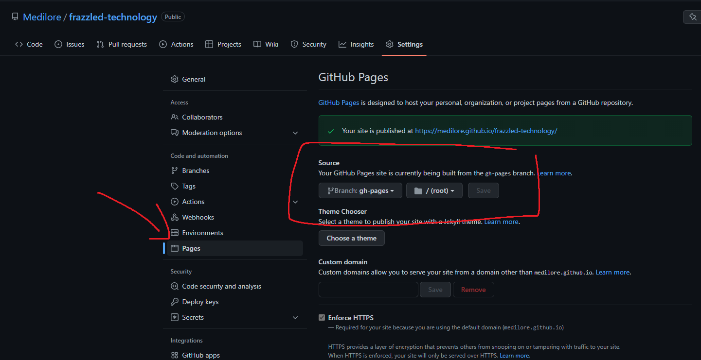

急にブログをやりたくなってしまったので、ざざっと作りました。

1 日もかからず出来ちゃって、こんなんでいいの？って思った。テーマも豊富でお手軽！最高！

## Hugo 導入

Windows 向けです。

1. [Hugo/release](https://github.com/gohugoio/hugo/releases)から対応 OS のバイナリダウンロード

1. Windows の Path 通す

`hugo new MY_SITE_NAME`

でサイト生成、

`hugo server -D`

で実行。

## theme 導入

[Hugo Themes](https://themes.gohugo.io/)から好きな theme を選び、
zip でダウンロードしてきて`/themes`にぶちこんで終わり。

git clone でも大丈夫

## 自分用に config をいじる

`/config.toml`をいじる

```toml
baseURL = 'https://Medilore.github.io/frazzled-technology/'
DefaultContentLanguage = "ja"
languageCode = "ja-jp"
title = 'frazzled-technology'
theme = "archie"
HasCJKLanguage = true
disableKinds = ["RSS"]
pygmentsCodeFences = false
Copyright = "frazzled-technology"

[params]
mode = "dark"
```

このサイトの config はこんな感じ。必須なのは`baseURL, title, theme`ぐらい？全てのオプションは[All Configuration Settings](https://gohugo.io/getting-started/configuration/#all-configuration-settings)にある。

## 記事をつくる

`hugo new post/HOGE.md`で記事作成。`/content/post/HOGE.md`に生成される。

あとは markdown をガリガリ書くだけ

frontmatter をいじりたかったら`/archetypes/default.md`をいじろう。

## 公開

`hugo`コマンドを実行すれば`/public`へ公開するためのファイルが生成される。

**が、**

私は github pages で公開したかったので、ちょっと回り道をする。

### gh-pages ブランチを作成

github pages を公開するには gh-pages ブランチとかいうのが必要らしいので、作る

```bash
git checkout --orphan gh-pages
git clean -fdx && test $(git ls-files | wc -l) -eq 0 || git rm -rf .
git commit -m "initial commit"
git push origin gh-pages
```

これで空の gh-pages ブランチが作成されるので、ここに public の中身をぶちまける

~~subtree, よくわからんので後で調べる~~

```bash
git checkout master
git subtree add --prefix=public git@github.com:[username]/YOURSITE.git gh-pages --squash
git subtree pull --prefix=public git@github.com:[username]/YOURSITE.git gh-pages
```

正常にできたら`hugo`で生成、普通に commit、push した後

```bash
git subtree push --prefix=public git@github.com:[username]/YOURSITE.git gh-pages
```

で、おわり。

## github pages の設定

最後の設定

Project ページの Settings から

{{}}

タブ中央の Pages へ行き、Source の Branch を gh-pages に、ディレクトリを root にして Save する。

{{}}

かんた～ん

記事更新したい時は stage, commit, push した後 build して subtree push する

めんどくせ～からバッチファイルとか作ったほうが良いかも

EOF
