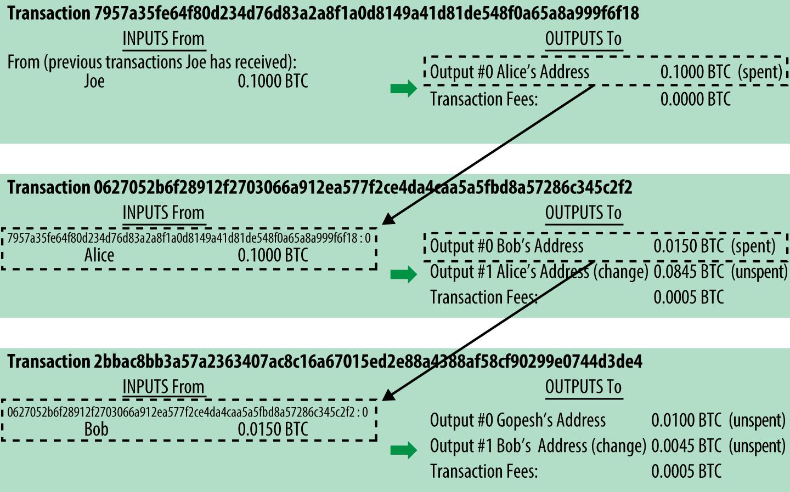
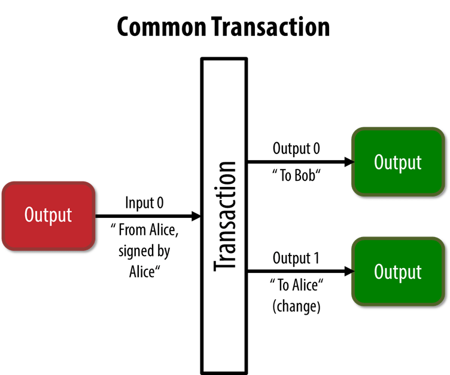
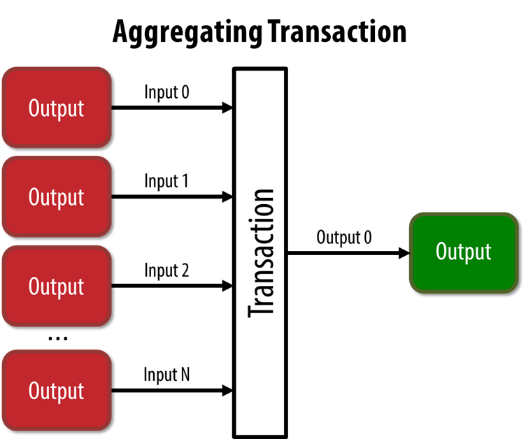
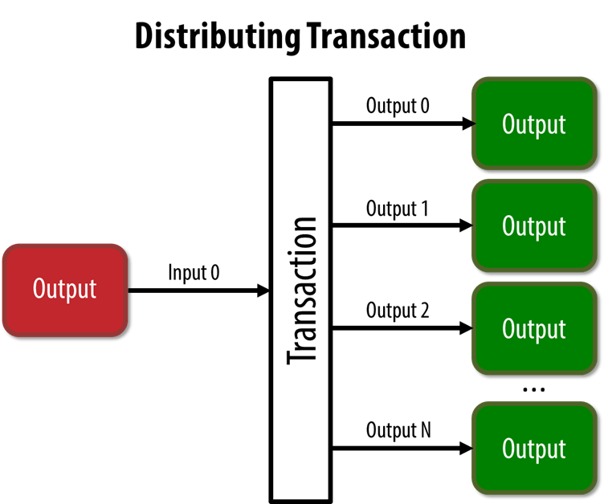

[Mastering Bitcoinを読んだのでアウトプットする]()　第二章目です。

これはMastering Bitcoinを読んでそれを私の言葉でまとめるだけの記事です。解説としては心もとないので、[原著](https://github.com/bitcoinbook/bitcoinbook/blob/develop/ch02.asciidoc)を読みながらこの記事を見ることをおすすめします！

## 前提

* アリスは友人から0.1BTCを買い、このBTCでコーヒーを買いたい。
* ボブは0.015BTCでコーヒーを売っている
  
このコーヒーの取引しながら、Transactionとはなにか？を説明しています。

## Bitcoin Transactions

[原著](https://github.com/bitcoinbook/bitcoinbook/blob/develop/ch02.asciidoc#bitcoin-transactions)より

> 簡単に言うと、Transactionは、あるビットコイン値の所有者がその値の別の所有者への転送を承認したことをネットワークに通知します。
> 
> 新しい所有者は、所有権の連鎖の中で、別の所有者への譲渡などを承認する別のTransactionを作成することにより、ビットコインを使うことができます。

わかりにくいけど要は取引です。アリスがボブに0.015BTCを送りたいって時に作るのがTransactionです。

### Transaction Inputs and Outputs

まず、Transactionは

* 入力と出力がそれぞれ1以上、必ずある
* 入力と出力は同じ料金になる保証はなく、基本的にマイナーに手数料が取られるので入力が多くなり出力がわずかに少なくなる。
* Transactionを作成した所有者が所有権の証明を行うスクリプトも含まれている。そしてそれは誰でも検証できる。

らしい。

BTC(blockchain)特有の事といえば、Transaction内に所有権を証明するスクリプトが含まれている事。

このスクリプトは後の章で説明されるので今詳しくは書かない。Transactionには誰から誰に送ったって情報があるよって感じです

### Transaction Chains

アリスとボブの取引が出てきます。

* 友人のジョーが0.1BTCをアリスに送り
* アリスはボブにコーヒー代として0.015BTCを送り0.0845BTCのお釣りを受け取る
* ボブはWebサイトのデザイン依頼料0.01BTCをGopeshに送る

というTransaction Chainが以下の画像。([原著](https://github.com/bitcoinbook/bitcoinbook/blob/develop/ch02.asciidoc#blockchain-mnemonic)内で使われている画像)

{{}}

そして、[原著](https://github.com/bitcoinbook/bitcoinbook/blob/develop/ch02.asciidoc#transaction-chains)には以下のような記述がある。

> Alice’s payment to Bob’s Cafe uses a previous transaction’s output as its input. In the previous chapter, Alice received bitcoin from her friend Joe in return for cash. That transaction created a bitcoin value locked by Alice’s key. Her new transaction to Bob’s Cafe references the previous transaction as an input and creates new outputs to pay for the cup of coffee and receive change. 

> アリスからボブのカフェへの支払いは、前の取引の出力を入力として使用します。前の章では、アリスは友人のジョーから現金と引き換えにビットコインを受け取りました。その取引はアリスの鍵でロックされたビットコイン値を作成した。彼女のBob's Cafeへの新しい取引は、前の取引を入力として参照し、コーヒーカップの支払いと釣銭を受け取るための新しい出力を作成する。

**前の取引の出力を入力**、これはUTXO(Unspent Transaction Output)と言って、OutputがまだないTransactionを残高として扱うという仕様から来ている。

**Outputがまだ無い = まだどこにも送っていない = そのアドレスに残高がある**

という事。

残高という情報でブロックチェーン上に保持しなくてもTransactionが使われていなければ残高があるということを証明できるから。。~~すご～い~~

このように、TransactionのOutputはInputになる。残高という情報はブロックチェーン上には存在しない。ということですね。

### Making Change

Changeは**変化**ではなく**お釣り**。

TransactionのOutputがそのままInputになるなら、小さい額(0.003BTCとか)を支払いたい時、お釣りはどうする？っていうのがこの話。

アリスとボブの取引と重ねて見ると、

* アリスが0.015BTCのコーヒーを支払うために、内部では0.1BTCのUTXOを送信
* ボブには0.015BTCが支払われ、残りの0.0845BTCは新たなアリスのアドレスとしてTransactionが生成される。これがお釣り用のアドレス。

[原著](https://github.com/bitcoinbook/bitcoinbook/blob/develop/ch02.asciidoc#making-change)は更にウォレット内部の動きを説明していて、

> 現実の財布でも、300円の支払いに1000円を使い続けていたら硬貨まみれになるだろう？そうならないように小銭が溜まってきたら、それらを集めて支払う。ウォレットの実装もそのようになっている**はず**だ。

こんな文章でもなければこんな口ぶりでもないけど、まあこんな感じのことを言ってます。

### Common Transaction Forms

一般的なTransactionのカタチ。主に3つ。

#### Common Transaction

上記のMaking Changeで話した、UTXOから

1. 宛先のアドレスへのOutput
2. 自分へのお釣りOutput
   
の2つが生成されるのが最も一般的なTransaction Formらしい。

{{}}

#### Aggregating Transaction

さて、もう一つは複数の入力を一つの出力にまとめるもの。

まあ・・・そのままですね。1円と5円玉だけでうまい棒買う、みたいなイメージです。

{{}}

#### Distributing Transaction

更にもう一つ、大きな入力を細かい出力にする。

これは給料の支払い、取引所の引き出し等によく使われる。

{{}}

これには`Transaction Batching`という名前がついていて、手数料を大幅に削減できるがプライバシーについて少し懸念がある模様。

> [Transaction Batching: Good for Fees, Bad for Privacy](https://news.bitcoin.com/transaction-batching-good-for-fees-bad-for-privacy/)に大まかな説明が。
> 
> [Reflections on Bitcoin Transaction Batching](https://blog.coinbase.com/reflections-on-bitcoin-transaction-batching-b13dad12a12)に影響が書かれている。特に後者の記事は大手取引所Coinbaseの記事なので、見て損はない。

デメリットよりもメリットのほうが大きいのかなって思います。

### Constructing a Transaction

Transactionの署名の話。

アリスが作成したボブへのTransactionは、

「ボブのアドレスが作られている"鍵"から署名を作成できる人がBTCを受け取れる」というスクリプトが含まれている。つまり **「ボブしか受け取れない」Transaction** ということ。

> 詳しくは第六章、[Transactions](https://github.com/bitcoinbook/bitcoinbook/blob/develop/ch06.asciidoc)で説明されています。今はざっくりな理解で良いと思います。

そのTransactionの入力は0.1BTCのUTXOであり、アリスが支払いたい0.015BTCよりはるかに大きいのでお釣り用のOutput 0.0845BTCが作成されます。(残りの0.0005BTCはマイナーへの手数料。)

{{}}

作成したTransactionを送信する方法は2つ。

* BTCノードに送信
* ボブのウォレットに直接送信

いずれもインターネットに繋がっている事が前提。Transactionはローカルで作成できるが送信はインターネット接続が必要。

有効なTransactionを受信したノードは、接続されている他の全てのノードに転送する。これを`flooding`と言う。らしいが調べても何も出てこない。~~何これ？~~

ボブのウォレットにこのTransactionが識別された時、即座に入金が完了する。

BTCのブロック周期は10分なので、10分程度待つ必要があると思っていたのだが違うらしい。以下引用。

> ビットコインTransactionに関する一般的な誤解は、新しいブロックを10分間待つか、完全な6つの確認を最大60分間待つことによって、ビットコインTransactionを「確認」する必要があるというものです。確認により、Transactionがネットワーク全体で受け入れられたことを確認できますが、コーヒーなどの価値の低いアイテムの場合、このような遅延は不要です。

Transactionには

* アリスのUTXOという事を証明するスクリプト
* ボブにしか解けない署名スクリプト

が含まれているから、ネットワークの承認を待たなくても良いということか？ほんとぉ？

### Bitcoin Mining

私が書いた[BitcoinのBlock Headerのハッシュとマイニング]()のような作業を行って、ブロックを検証する。これにより、ブロック、ブロックチェーンの書き換えに莫大な計算量が必要となるため改竄がしにくくなる。

ここはもう理解してるので飛ばす。

### Spending the Transaction

アリスのTransactionが含まれたブロックがブロックチェーンに含まれると、各BTCクライアントからそのTransactionが有効な事を個別(ローカル)で検証できるようになる。

また、その後にいくつかのブロックがマイニングされることによって更に安全な有効なブロックという事が保証されるようになる。(だいたい6承認ぐらいらしい)

これでボブは、受け取ったTransactionを他のTransactionの入力として使えるようになる。

## まとめ

* Transactionは取引の記録
* そのTransactionに所有者の署名がある
* ネットワークに送信したTransactionはブロックに追加される
* ブロックはマイニングにより検証され、ブロックチェーンに追加される
* ブロックチェーンに追加されると、そのTransactionは新しい所有者のUTXO(残高)となる
* 残高はUTXOで管理しており、OutputがそのままInputになる
* お釣りが発生した場合は、お釣り用のTransactionが生成される。

こんなところかなぁ。数式やら実装やらはなかったが、そのせいで曖昧な表現をしていて逆に理解しづらかった部分があった。多分後の章で解説されるので、そこまでお預けかな。

個人的には、Transaction Batchingが新たな発見だった。改めて見るとBlockchainについて何もわかってなかったんだなと思い知らされる。無知の知。

~~一応この記事だけ見てもなんとなーくわかるようには努めたけど、あくまでも[原著](https://github.com/bitcoinbook/bitcoinbook)の理解のための殴り書きみたいなものなので、理解できなかったらごめんなさい。ゆるして。~~

EOF